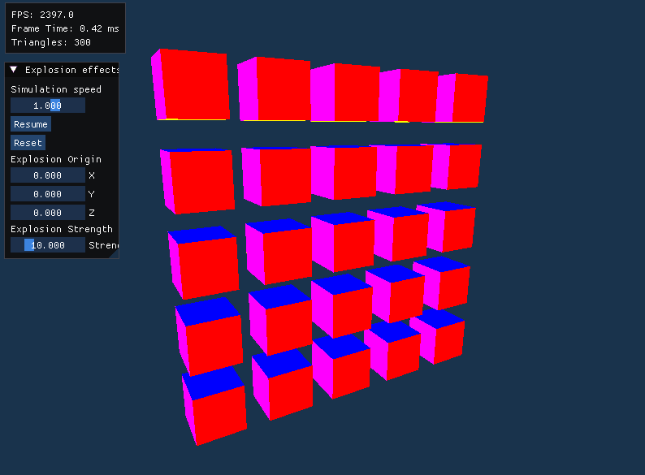

# GKOM 2025L Project - Explosion geometry shader

## Configuration
### Assimp
Configured in vcpkg, it should automatically download a .dll when building.
If there are problems follow the steps below.

Get this release https://github.com/assimp/assimp/releases/tag/v5.4.3 or just git clone.  
Go to the assimp directory

    cmake CMakeLists.txt -A Win32
    cmake --build .

Find the assimp-vc143-mtd.dll file in bin/debug and paste it into the debug and release directories.

## Usage
### THIS PROJECT ONLY WORKS IN 32 BIT.
Load your model like this in the OpenGlWindow main loop. The model must be located in the Resources/Models directory, and the path is relative from there. Textures and the model file must be in the same directory.

    fs::path ratPath = "RAT/RAT.fbx";
    RegularModel ratReg(ratPath);

It's also possible to use models with instacing

    InstancedModel(const fs::path& relativePath, const std::vector<glm::mat4 instanceMatrices)

It's also possible to control many more variables by modifying the const parameters in the shader

    const float G = 10.0;
    const float ground = -10.0;
    const float rampTime = 0.2;
    const float baseAngularVelocity = 2.0;
    const float baseAngularAccel = 0.4;

### Examples

### Included models
https://sketchfab.com/3d-models/rat-animated-cba5c3b8a946499083b4adfbb6d568b8  
https://sketchfab.com/3d-models/chiyo-mihama-3ef989077b79498b8c55590c4934f194

Used in gif
https://sketchfab.com/3d-models/low-poly-winter-scene-2ffe1ed449414cc184078dd1e2882284
